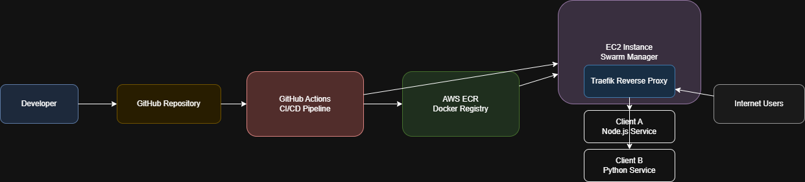

# Multi-Client Scalable Application Platform (Docker Swarm on AWS)

This project demonstrates the design and deployment of a scalable, multi-client application environment on AWS EC2 using Docker Swarm.

The system supports:

- Multiple services (Node.js + FastAPI)
- Client-specific configurations
- Horizontal scaling
- Reverse proxy routing
- CI/CD based automated deployments
- Production-oriented deployment strategy

The focus of this implementation is not just containerization — but architecture thinking for real multi-tenant growth.

---

## 🏗 Architecture Overview



### High-Level Flow

1. Developer pushes code to GitHub  
2. GitHub Actions builds Docker images  
3. Images are tagged with commit SHA  
4. Images are pushed to AWS ECR  
5. Swarm Manager deploys updated stack  
6. Traefik routes traffic to scaled replicas  

---

# 🧩 Application Components

## Client A – Node.js (REST API)

- Multi-stage Docker build
- Production-only dependencies in final image
- Designed for horizontal scaling

## Client B – Python (FastAPI)

- Slim Python base image
- Minimal footprint
- ASGI-based high-performance service

Each client:

- Has separate environment variables
- Uses separate secrets
- Can be independently scaled
- Can be versioned independently

---

# 🐳 Containerization Strategy

### Node.js (Multi-Stage Build)

- Stage 1 → Install dependencies & build
- Stage 2 → Copy compiled output only
- Final image is lightweight and production-ready

### Python (Slim Image)

- Uses `python:3.x-slim`
- Installs only required dependencies
- No unnecessary build tools retained

### .dockerignore

Used to remove:
- node_modules
- local logs
- test files
- Git metadata

This keeps images clean and small.

---

# 🐝 Docker Swarm Architecture

## Cluster Setup

- 1 Manager node
- 1+ Worker nodes
- Overlay networking enabled
- Internal service discovery via DNS

Deployment done using:
docker stack deploy -c stack.yml multi-client-stack


---

## Stack Features

Each service includes:

```yaml
deploy:
  replicas: 3
  restart_policy:
    condition: on-failure
  update_config:
    parallelism: 1
    delay: 10s


What This Ensures

- 3 replicas for availability
- Rolling updates (1 container at a time)
- Zero downtime deployments
- Automatic restart on failure

## Reverse Proxy (Traefik)
Traefik is used as a dynamic reverse proxy.

Routing rules:

client-a.example.com → Node service

client-b.example.com → Python service

Why Traefik?

-Native Docker Swarm integration
-Auto service discovery
-Built-in load balancing
-Optional Let's Encrypt support
- No manual config reloads

Traffic is automatically balanced across replicas

## Scaling Strategy - Manual Scaling
docker service scale multi-client-stack_client-a=5

Swarm automatically:

-Distributes containers across nodes
-Updates internal DNS
-Balances traffic


## Rolling Updates

When a new image is deployed:

-One replica is updated at a time
-Traffic continues flowing
-Failed updates auto-rollback
This ensures high availability.

## CI/CD Pipeline

Implemented using GitHub Actions.

Pipeline Flow:
1.Checkout repository
2.Generate short commit SHA tag
3.Build Docker images
4.Push to AWS ECR
5.SSH into Swarm manager
6. Deploy updated stack

Images are tagged as:
client-a-node:<short-sha>
client-b-python:<short-sha>

This ensures:

Traceability
Easy rollback
Clear deployment history

##Multi-Client Growth Strategy (Scaling to 20+ Clients Monthly)

As the number of onboarded clients increases, the architecture must move from a simple deployment model to a structured multi-tenant strategy.

If 20 new clients are added monthly, here is how I would approach it:

1. Networking Strategy

I would use 

1. Networking Strategy
I would use a shared Swarm cluster with logical isolation per client.

Approach:
Each client gets its own stack:

client-a-stack
client-b-stack
client-c-stack

- Each stack runs inside its own overlay network.
- Internal service discovery remains isolated within that network.
- Reverse proxy (Traefik) routes based on domain/subdomain.

This provides:
* Logical isolation
* Simpler debugging
* Cleaner service discovery
* Reduced blast radius

If a client fails, it does not affect others.

2. Image Versioning Strategy
I avoid using latest.

Instead:
- Images are tagged with commit SHA
- Optionally versioned like:

client-a:1.2.4
client-a:<commit-sha>

Why?

* Immutable deployments
* Easy rollback
* Full traceability
* Debugging clarity

If Client X is on version abc1234, I can trace exactly what code is running. For enterprise clients, I may even pin stable versions separately.

3. Secrets Management
Currently Docker Swarm secrets for:

- Database credentials
- API keys
- Environment configs

Each client has separate secrets.

Future improvement:
* Integrate AWS Secrets Manager
* Automate injection via Terraform

Why separate secrets?
* Because even in a shared cluster
* No client should access another client’s credentials
* Separation reduces risk exposure

4. Scaling Strategy
Scaling happens at multiple levels:

- Application Scaling

Each service:
deploy:
  replicas: 3

We can increase replicas per client independently:
docker service scale client-a=5

Swarm:
* Distributes containers across nodes
* Automatically load balances
* Maintains internal DNS

Node-Level Scaling
If load increases:

- Add new EC2 instances
- Join them as Swarm workers
- Services automatically rebalance
- This avoids vertical scaling bottlenecks.

Placement Constraints
For high-value clients:

Use node labels:
docker node update --label-add tier=enterprise node-2

Then in stack 
placement:
  constraints:
    - node.labels.tier == enterprise

This ensures:
* Dedicated compute resources
* Premium client isolation
* Resource prioritization

5. Shared Cluster vs Per-Client Cluster
I would not create a new EC2 cluster per client initially.

That would:
- Increase cost
- Increase operational complexity
- Create management overhead

Instead:

Use:
Shared Swarm cluster
Per-client stack isolation
Resource quotas
Placement constraints
note - Only enterprise-level clients may justify isolated clusters.

6. Cost Optimization Strategy
To handle onboarding 20+ clients monthly:
- Shared EC2 instances
- Right-sized instance types
- Horizontal scaling over vertical
- Use ARM instances where possible
- Use spot instances for non-critical workloads
- Auto-scale EC2 using Auto Scaling Groups

Terraform can define:
Launch templates
ASG policies
Target CPU-based scaling
This keeps cost predictable while maintaining performance.

## Monitoring & Logging Strategy
As the number of clients grows, observability becomes critical.
1. Centralized Logging
I would implement:

Option A:
ELK Stack (Elasticsearch, Logstash, Kibana)

Option B (lighter):
Loki + Grafana

Each container:
Streams logs to centralized system

Tagged by:
Client
Service
Environment

This allows:
Fast issue tracing
Client-specific debugging
Production-grade observability
Metrics Monitoring

Use Prometheus:
Container-level metrics
CPU usage
Memory usage
Replica health
Node metrics via node-exporter
Dashboards via Grafana.

This enables:
Capacity planning
Predictive scaling
Early issue detection

2. Healthchecks
Each service defines:

HEALTHCHECK CMD curl --fail http://localhost:3000/health || exit 1

Swarm:
Detects unhealthy containers
Restarts automatically
Maintains replica count
This ensures availability.

